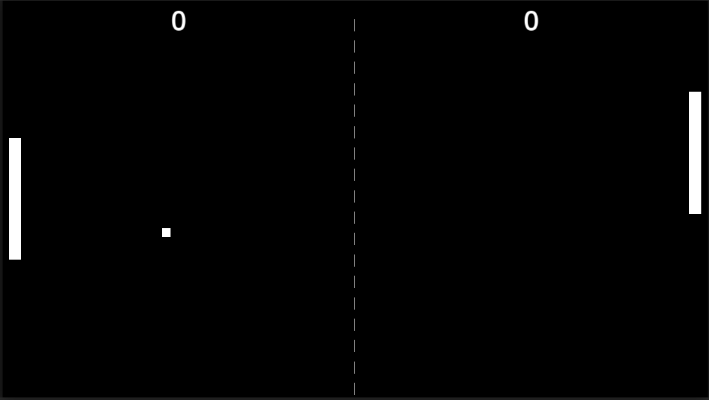

# Pong

*[Versión en español](README.md)*

My take on classic Pong, built in Godot 4.6 as **game 1** of the [20 Games Challenge](https://20_games_challenge.gitlab.io/).

## Original Pong

Pong is one of the oldest and most important video games in history. Its direct predecessor is *Tennis for Two* (1958), created by William Higinbotham, which ran on an oscilloscope as a display and an analog computer to calculate the "ball" trajectory. Fourteen years later, in 1972, Atari released *Pong* to arcades and it became the hit that kicked off the video game industry as we know it today.

The premise is minimalist: two paddles, a ball and a scoreboard. But behind that simplicity lie all the basic building blocks of any game: player input, physics, collisions, scoring and a win condition. That's exactly what makes it the perfect exercise to kick off a challenge like this one.

## Why I made this game

This project is the first entry of the [20 Games Challenge](https://20_games_challenge.gitlab.io/), a challenge that consists of recreating 20 classic games to learn (or brush up on) game development progressively, starting with the simplest concepts and gradually ramping up the complexity.

Pong tops the list for good reason: it's simple enough to finish without getting overwhelmed, but it touches almost every basic system of a game engine (input, 2D physics, signals, UI, audio...). It was also my first serious hands-on time with Godot, so it was the perfect starting point to get familiar with the editor and its workflow before diving into more ambitious projects.

## What I learned with this game

On the concepts side:

- How to organize a Godot project by scenes, keeping each one self-contained (script, resources and nodes all together).
- How the engine's main nodes work and what each one is for.
- Godot's signal system for communicating between nodes without coupling them together.
- How to wire up sound effects to in-game actions and events.
- 2D physics: the differences between static, character and rigid bodies, and how to control bounces and collisions manually.

Nodes used:

- `Node2D`
- `ColorRect`
- `CollisionObject2D`
- `CanvasLayer`
- `CharacterBody2D`
- `RigidBody2D`
- `AudioStreamPlayer`
- `Control`
- `Button`
- `Label`
- `CollisionShape2D`
- `StaticBody2D`
- `Area2D`

## Controls

| Player | Up | Down |
| --- | --- | --- |
| Left | `W` | `S` |
| Right | `↑` (up arrow) | `↓` (down arrow) |

## Credits

The sound effects used in this project are not my own. Thanks to their authors:

**Bounce sound** (paddle and walls)
- File: `Bleep_04.wav`
- Pack: *Interface Bleeps Wav*
- Author: [bleeoop](https://bleeoop.itch.io/interface-bleeps)

**Point scored sound**
- File: `Complete_02.wav`
- Pack: *Interface Bleeps Wav*
- Author: [bleeoop](https://bleeoop.itch.io/interface-bleeps)

**Match won sound**
- File: `703543__yoshicakes77__win.ogg`
- Author: [Yoshicakes77](https://freesound.org/people/Yoshicakes77/sounds/703543/)

## Possible future improvements

The game is finished and playable, but there's a lot more that could be done with it. Some ideas to come back to in spare time:

- **AI opponent**, to play solo.
- **Difficulty selector**, with variants such as:
  - Smaller or faster paddles.
  - Random obstacles in the middle of the field that deflect the ball's path.
- A real **options screen** (volume, controls, etc.).
- Gamepad support, or even a 4-player mode.
- **Ball trail effect**: a fading trail behind the ball that gets longer the faster it goes. This is a purely visual improvement, with no effect on gameplay, but it helps convey a sense of speed.

## License

This project is licensed under the MIT License. See the [LICENSE.md](LICENSE.md) file for details.
